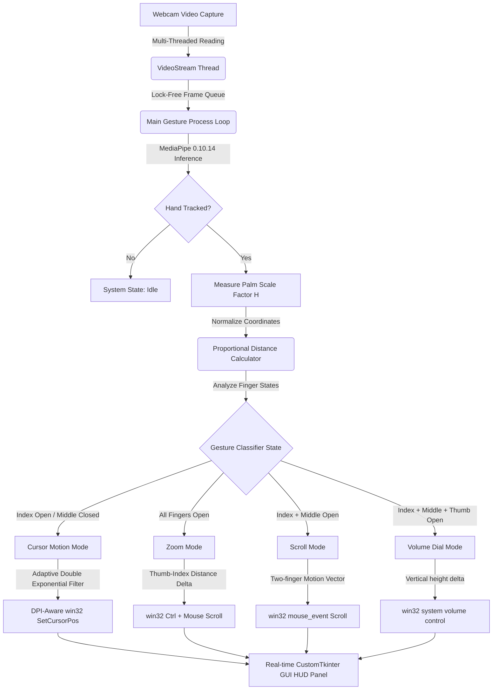

<p align="center">
  
</p>

<h1 align="center" style="font-size: 32px; font-weight: 800; border-bottom: none; margin-bottom: 0;">✈️ AeroGlide Virtual Touchpad</h1>
<p align="center" style="font-size: 16px; color: #8a8a93; margin-top: 5px;">Transform your hand gestures into responsive, zero-latency desktop navigation.</p>

<p align="center">
  
  
  
  
  
</p>

---

## ⚡ Core Engine Highlights

AeroGlide is a state-of-the-art virtual touchpad that turns real-time camera coordinates into fluid, organic mouse movements. By bypassing standard automation latency and using low-level Win32 inputs, AeroGlide delivers a zero-lag desktop control experience.

<br>

<table width="100%" style="border-collapse: collapse; border: none; background: transparent;">
  <tr style="border: none; background: transparent;">
    <td width="50%" style="padding: 10px; border: none;">
      <div style="background: #1E1E24; padding: 20px; border-radius: 12px; border: 1px solid #2C2C35; height: 160px;">
        <h3 style="margin-top: 0; color: #00FF80; font-size: 16px;">⚡ win32 Kernel Input Acceleration</h3>
        <p style="font-size: 13px; color: #b0b0b5; margin-bottom: 0; line-height: 1.5;">Bypasses heavy high-level libraries. Calls Windows User32 APIs (<code>SetCursorPos</code> and <code>mouse_event</code>) directly via Python ctypes, delivering instant, hardware-level cursor responses.</p>
      </div>
    </td>
    <td width="50%" style="padding: 10px; border: none;">
      <div style="background: #1E1E24; padding: 20px; border-radius: 12px; border: 1px solid #2C2C35; height: 160px;">
        <h3 style="margin-top: 0; color: #00DFFF; font-size: 16px;">📐 Orientation-Independent Gestures</h3>
        <p style="font-size: 13px; color: #b0b0b5; margin-bottom: 0; line-height: 1.5;">Uses dynamic palm-scaling ratios $D = \text{dist}(\text{Tip}, \text{Wrist}) / H$. Finger folds are calculated proportionally, making gestures 100% immune to hand tilt, rotation, or orientation.</p>
      </div>
    </td>
  </tr>
  <tr style="border: none; background: transparent;">
    <td width="50%" style="padding: 10px; border: none;">
      <div style="background: #1E1E24; padding: 20px; border-radius: 12px; border: 1px solid #2C2C35; height: 160px;">
        <h3 style="margin-top: 0; color: #FFFF00; font-size: 16px;">📈 Adaptive Double Smoothing</h3>
        <p style="font-size: 13px; color: #b0b0b5; margin-bottom: 0; line-height: 1.5;">An intelligent filter that scales smoothing dynamically. Slow movements get high damping to remove hand tremors (pixel-perfect precision); fast movements get high speed to avoid dragging latency.</p>
      </div>
    </td>
    <td width="50%" style="padding: 10px; border: none;">
      <div style="background: #1E1E24; padding: 20px; border-radius: 12px; border: 1px solid #2C2C35; height: 160px;">
        <h3 style="margin-top: 0; color: #FF4040; font-size: 16px;">🛡️ Schmitt Trigger Click Latch</h3>
        <p style="font-size: 13px; color: #b0b0b5; margin-bottom: 0; line-height: 1.5;">Features a magnetic hysteresis latch. Clicks trigger at <code>0.032</code> units and only release when opened beyond <code>0.047</code>. This completely eliminates micro-clicks during pointer navigation.</p>
      </div>
    </td>
  </tr>
</table>

<br>

---

## 🎨 Interactive Gesture Dashboard

AeroGlide maps natural hand shapes into high-fidelity desktop actions:

```
         ☝️                🤌                ✊                👌
   CURSOR NAVIGATION    LEFT CLICK        DRAG & DROP      VOLUME CONTROL
```

| Mode | Gesture Type | Hand Shape | Action Triggered |
| :--- | :--- | :--- | :--- |
| **Cursor Control** | ☝️ **Navigation** | Index extended; other fingers folded | Butter-smooth, jitter-free cursor tracking |
| **Left Click** | 🤌 **Pinch Action** | Pinch Index & Thumb tips together | Instant Left Click (debounced) |
| **Drag & Drop** | ✊ **Hold Pinch** | Pinch Index & Thumb and hold for >0.4s | Left Mouse Down (hold & drag; release to drop) |
| **Double Click** | 🤌🤌 **Double Tap** | Pinch Index & Thumb twice rapidly | Double Click action (within 0.35s) |
| **Right Click** | ✌️ **Middle Pinch**| Pinch Middle & Thumb (Index open) | Right Mouse Click (ignores folded middle) |
| **Web Scroll** | ✌️ **Two-finger Drag**| Index & Middle open close together | Butter-smooth Vertical / Horizontal page scroll |
| **Zoom In/Out** | 🖐️ **Open hand span**| Keep 5 fingers open, scale Thumb-Index | Zoom In (spread apart) / Zoom Out (pinch close) |
| **Volume Control** | 👌 **Volume Dial** | Thumb, Index, Middle open (Ring/Pinky closed) | System Volume UP (raise hand) / Volume DOWN |

---

## 🛠️ System Architecture Diagram



---

## 📦 Repository Structure

* [app.py](file:///c:/Users/ASUS/Downloads/touch%20pad/app.py): The entry point. A gorgeous CustomTkinter dark-mode control center featuring active-zone visualization, live state feedback, and slider diagnostics.
* [gesture_engine.py](file:///c:/Users/ASUS/Downloads/touch%20pad/gesture_engine.py): The core logic. Manages hand coordinate normalizations, DPI-awareness, proportional gesture states, and Win32 low-level hardware input simulations.
* [smooth.py](file:///c:/Users/ASUS/Downloads/touch%20pad/smooth.py): Damps high-frequency hand tremors using our custom mathematical **Adaptive Exponential Smoother**.
* [video_stream.py](file:///c:/Users/ASUS/Downloads/touch%20pad/video_stream.py): Runs camera acquisition in a separate thread to prevent webcam frame read blocks, maximizing tracking FPS.

---

## 📥 Getting Started

### Prerequisites
* **Windows OS** (required for low-level win32 ctypes input calls).
* **Python 3.12** (highly recommended for stable MediaPipe Solution pre-built binary distributions).

### Installation Instructions

1. **Clone this repository:**
   ```bash
   git clone https://github.com/idusha-manaka/aero-glide.git
   cd aero-glide
   ```

2. **Install core dependencies:**
   ```bash
   pip install mediapipe==0.10.14 pyautogui customtkinter opencv-python
   ```

3. **Run the Application:**
   ```bash
   python app.py
   ```

---

## ⚙️ Calibration & Customization

AeroGlide features a real-time dark-theme GUI control panel to easily calibrate pointer response to fit your workspace:

<p align="center">
  
</p>

<details>
  <summary><b>🔍 View Advanced Calibration Details</b></summary>
  
  * **Cursor Speed / Sensitivity:** Resizes the Active Zone dynamically. Set between `0.7x` and `0.8x` for a highly comfortable, low-fatigue pointer movement.
  * **Fine Precision Smoothing:** Removes micro-tremors when moving slowly. Reduce towards `0.05` for extreme precision when drawing or editing.
  * **Fast Motion Responsiveness:** Dampens maximum flick responses. Set between `0.75` and `0.85` for absolute zero lag.
  * **Pinch Click Threshold:** Controls how tightly you need to pinch to click. The default `0.032` requires a comfortable, intentional pinch.
</details>

---

## 📄 License
This project is licensed under the MIT License - see the [LICENSE](LICENSE) file for details.

## 🤝 Community & Support
Developed with ❤️ by [Idusha Manaka](https://github.com/idusha-manaka). Feel free to raise issues, submit pull requests, or star the repository to show your support!
