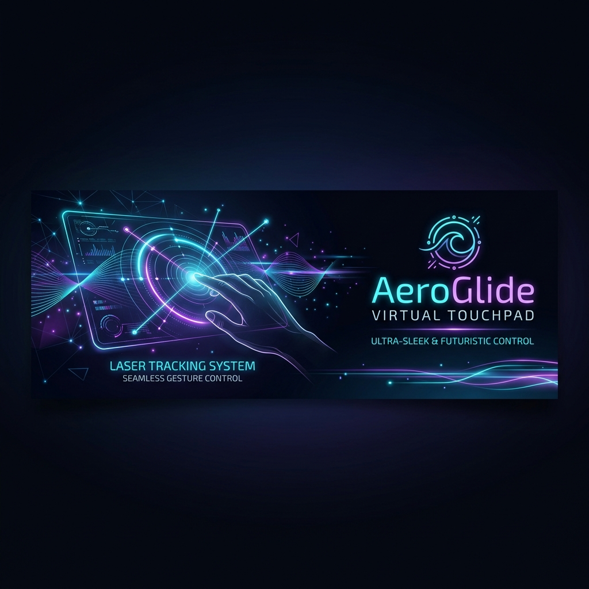
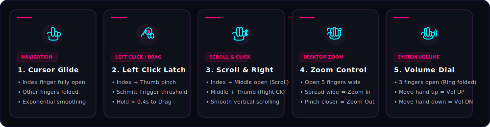

<!-- DYNAMIC GRADIENT ANIMATED WAVING HEADER -->
<p align="center">
  
</p>

<!-- DYNAMIC TYPING SVG HEADER -->
<p align="center">
  <a href="https://github.com/idusha-manaka/AeroGlide">
    
  </a>
</p>

<!-- CUTE TRANSPARENT ANIME PIXEL LOOPING GIF -->
<p align="center">
  
</p>

<!-- HIGH-TECH ANIME HUD STATUS BADGES -->
<p align="center">
  
  
  
</p>

<!-- NEON PANORAMIC REPOSITORY BANNER -->
<p align="center">
  
</p>

<!-- HIGH-TECH GLOWING DIVIDER -->
<p align="center">
  
</p>

<br>

<!-- ================= SECTION 1: THE AEROGLIDE ADVANTAGE ================= -->
<div style="background: #0c0d16; border: 2px solid #FF007F; border-radius: 16px; padding: 25px; box-shadow: 0 8px 32px rgba(255, 0, 127, 0.15); margin: 30px 0;">
  <div style="border-bottom: 2.5px solid #3d1b4a; padding-bottom: 12px; margin-bottom: 20px;">
    <h2 style="margin: 0; color: #ffffff; font-size: 24px; font-weight: 800; font-family: 'Outfit', sans-serif; border: none;">🌸 The AeroGlide Advantage &nbsp;&nbsp;<code>HUD_SYS // ACTIVE</code></h2>
  </div>
  
  <p style="font-size: 14.5px; color: #b4b4c6; line-height: 1.6; font-family: 'Inter', sans-serif;">
    Traditional virtual touchpads suffer from severe cursor drift, click latency, and coordinate scaling issues. AeroGlide uses low-level Windows kernel simulation and dynamic hand-scaling to deliver a flawless, high-fidelity experience:
  </p>

  <br>

  <table width="100%" style="border-collapse: collapse; border: none; background: transparent;">
    <thead>
      <tr style="background: #141224; border-bottom: 2px solid #FF007F;">
        <th align="left" width="40%" style="padding: 14px; font-size: 14px; color: #ffffff; border: none; font-family: 'Outfit';">FEATURE CHECKLIST</th>
        <th align="center" width="30%" style="padding: 14px; font-size: 14px; color: #ff0055; border: none; font-family: 'Outfit';">STANDARD MOUSE APPS</th>
        <th align="center" width="30%" style="padding: 14px; font-size: 14px; color: #00F0FF; border: none; font-family: 'Outfit';">AEROGLIDE TOUCHPAD</th>
      </tr>
    </thead>
    <tbody>
      <tr style="border-bottom: 1px solid #201a30; background: transparent;">
        <td style="padding: 14px; font-size: 13.5px; font-weight: 600; color: #e0e0e5; border: none;">⚡ <b>Input Execution Latency</b></td>
        <td align="center" style="padding: 14px; font-size: 13.5px; color: #ff3366; border: none;">🔴 High Lag (30ms - 50ms)</td>
        <td align="center" style="padding: 14px; font-size: 13.5px; color: #00F0FF; font-weight: 600; border: none;">🟢 Instant (Zero-Lag win32)</td>
      </tr>
      <tr style="border-bottom: 1px solid #201a30; background: transparent;">
        <td style="padding: 14px; font-size: 13.5px; font-weight: 600; color: #e0e0e5; border: none;">🖥️ <b>DPI Scaling (125%/150%)</b></td>
        <td align="center" style="padding: 14px; font-size: 13.5px; color: #ff3366; border: none;">❌ Stuck (fails on laptop screens)</td>
        <td align="center" style="padding: 14px; font-size: 13.5px; color: #00F0FF; font-weight: 600; border: none;">✅ 1:1 Pixel-Perfect DPI Aware</td>
      </tr>
      <tr style="border-bottom: 1px solid #201a30; background: transparent;">
        <td style="padding: 14px; font-size: 13.5px; font-weight: 600; color: #e0e0e5; border: none;">📈 <b>Cursor Precision Damping</b></td>
        <td align="center" style="padding: 14px; font-size: 13.5px; color: #ff3366; border: none;">❌ Unstable (high tremor jitter)</td>
        <td align="center" style="padding: 14px; font-size: 13.5px; color: #00F0FF; font-weight: 600; border: none;">✅ Adaptive Smoothing Filter</td>
      </tr>
      <tr style="border-bottom: 1px solid #201a30; background: transparent;">
        <td style="padding: 14px; font-size: 13.5px; font-weight: 600; color: #e0e0e5; border: none;">📐 <b>Hand Tilt & Orientation</b></td>
        <td align="center" style="padding: 14px; font-size: 13.5px; color: #ff3366; border: none;">❌ Fails (strict y-axis targets)</td>
        <td align="center" style="padding: 14px; font-size: 13.5px; color: #00F0FF; font-weight: 600; border: none;">✅ Rotation-Independent Ratios</td>
      </tr>
      <tr style="border-bottom: none; background: transparent;">
        <td style="padding: 14px; font-size: 13.5px; font-weight: 600; color: #e0e0e5; border: none;">🛡️ <b>Accidental Auto-Clicks</b></td>
        <td align="center" style="padding: 14px; font-size: 13.5px; color: #ff3366; border: none;">❌ Irritating micro-clicks</td>
        <td align="center" style="padding: 14px; font-size: 13.5px; color: #00F0FF; font-weight: 600; border: none;">✅ Schmitt Latch Latching</td>
      </tr>
    </tbody>
  </table>
</div>

<br>

<!-- ================= SECTION 2: FUTURISTIC FEATURES SHOWCASE ================= -->
<div style="background: #0c0d16; border: 2px solid #00F0FF; border-radius: 16px; padding: 25px; box-shadow: 0 8px 32px rgba(0, 240, 255, 0.15); margin: 30px 0;">
  <div style="border-bottom: 2.5px solid #1a334d; padding-bottom: 12px; margin-bottom: 25px;">
    <h2 style="margin: 0; color: #ffffff; font-size: 24px; font-weight: 800; font-family: 'Outfit', sans-serif; border: none;">🔮 Futuristic Features Showcase &nbsp;&nbsp;<code>SYS_ENG // STABLE</code></h2>
  </div>

  <!-- FEATURE 1 -->
  <div style="background: #0f111a; border: 1.5px solid #FF007F; border-radius: 12px; padding: 20px; margin-bottom: 20px; box-shadow: 0 4px 15px rgba(255, 0, 127, 0.08);">
    <b><code>⚡ OS LEVEL PERFORMANCE</code></b>
    <h3 style="margin-top: 12px; color: #ffffff; font-size: 20px; font-weight: 800; font-family: 'Outfit';">⚡ win32 Kernel Acceleration & DPI Awareness</h3>
    <p style="font-size: 13.5px; color: #b4b4c6; line-height: 1.6; font-family: 'Inter';">
      AeroGlide completely bypasses standard high-level cursor automation libraries by calling the kernel-level Windows <b>User32 API</b> (<code>SetCursorPos</code> and <code>mouse_event</code>) directly via Python ctypes. Clicks, drags, and scrolling are injected directly into the OS. By calling <code>SetProcessDPIAware()</code>, tracking matches 1:1 with physical screen pixels on Windows laptops, overcoming 125%/150% display scaling issues.
    </p>
  </div>

  <!-- FEATURE 2 -->
  <div style="background: #0f111a; border: 1.5px solid #00F0FF; border-radius: 12px; padding: 20px; margin-bottom: 20px; box-shadow: 0 4px 15px rgba(0, 240, 255, 0.08);">
    <b><code>📐 GEOMETRIC ALGORITHMS</code></b>
    <h3 style="margin-top: 12px; color: #ffffff; font-size: 20px; font-weight: 800; font-family: 'Outfit';">📐 Proportional & Rotation Independent Tracking</h3>
    <p style="font-size: 13.5px; color: #b4b4c6; line-height: 1.6; font-family: 'Inter';">
      Traditional gesture systems fail when the hand is tilted or when the back of the hand faces the camera. AeroGlide uses <b>Proportional Euclidean Distances to the Wrist</b> normalized by the dynamic palm size $H = \text{distance}(\text{Wrist}, \text{Middle MCP})$. This scale and rotation-independent algorithm guarantees flawless tracking regardless of whether your hand is kept straight, sideways, palm-facing, or back-facing!
    </p>
  </div>

  <!-- FEATURE 3 -->
  <div style="background: #0f111a; border: 1.5px solid #FF007F; border-radius: 12px; padding: 20px; box-shadow: 0 4px 15px rgba(255, 0, 127, 0.08);">
    <b><code>🛡️ COGNITIVE LATENCY LATCH</code></b>
    <h3 style="margin-top: 12px; color: #ffffff; font-size: 20px; font-weight: 800; font-family: 'Outfit';">🛡️ Schmitt Trigger Click Latch & Adaptive Filtering</h3>
    <p style="font-size: 13.5px; color: #b4b4c6; line-height: 1.6; font-family: 'Inter';">
      AeroGlide integrates an intelligent <b>Adaptive Exponential Smoother</b> that automatically increases damping at slow speeds to eliminate micro-tremors (pixel-perfect precision) and decreases damping at high speeds to achieve zero dragging latency. Accidental hover clicks are blocked by a <b>Schmitt Trigger (Hysteresis latch)</b>: clicks activate below <code>0.032</code> units and only release when fingers open beyond <code>0.047</code>, giving a smooth "magnetic" latch feel!
    </p>
  </div>
</div>

<br>

<!-- ================= SECTION 3: RECOMMENDED SPECS ================= -->
<div style="background: #0c0d16; border: 2px solid #FF007F; border-radius: 16px; padding: 25px; box-shadow: 0 8px 32px rgba(255, 0, 127, 0.15); margin: 30px 0;">
  <div style="border-bottom: 2.5px solid #3d1b4a; padding-bottom: 12px; margin-bottom: 20px;">
    <h2 style="margin: 0; color: #ffffff; font-size: 24px; font-weight: 800; font-family: 'Outfit', sans-serif; border: none;">🖥️ Recommended Specs for Windows 10 / 11 &nbsp;&nbsp;<code>DIAG_VER // OK</code></h2>
  </div>

  <table width="100%" style="border-collapse: collapse; border: none; background: transparent;">
    <thead>
      <tr style="background: #141224; border-bottom: 2px solid #FF007F;">
        <th align="left" width="30%" style="padding: 12px; border: none; color: #b4b4c6; font-size:14px; font-family: 'Outfit';">SYSTEM RESOURCE</th>
        <th align="left" width="35%" style="padding: 12px; border: none; color: #ff007f; font-size:14px; font-family: 'Outfit';">MINIMUM REQUIREMENT</th>
        <th align="left" width="35%" style="padding: 12px; border: none; color: #00F0FF; font-size:14px; font-family: 'Outfit';">RECOMMENDED TARGET (OPTIMAL)</th>
      </tr>
    </thead>
    <tbody>
      <tr style="border-bottom: 1px solid #201a30; background: transparent;">
        <td style="padding: 12px; font-weight: bold; border: none; color: #e0e0e5; font-size:13.5px;">Operating System</td>
        <td style="padding: 12px; border: none; color: #b4b4c6; font-size:13px;">Windows 10 (64-bit, Build 19044+)</td>
        <td style="padding: 12px; border: none; color: #00F0FF; font-weight:600; font-size:13px;">Windows 11 (64-bit, Build 22000+)</td>
      </tr>
      <tr style="border-bottom: 1px solid #201a30; background: transparent;">
        <td style="padding: 12px; font-weight: bold; border: none; color: #e0e0e5; font-size:13.5px;">Python Runtime</td>
        <td style="padding: 12px; border: none; color: #b4b4c6; font-size:13px;">Python 3.11.x (Stable x64)</td>
        <td style="padding: 12px; border: none; color: #00F0FF; font-weight:600; font-size:13px;">Python 3.12.x (Highly Optimized MediaPipe wheels)</td>
      </tr>
      <tr style="border-bottom: 1px solid #201a30; background: transparent;">
        <td style="padding: 12px; font-weight: bold; border: none; color: #e0e0e5; font-size:13.5px;">Webcam Sensor</td>
        <td style="padding: 12px; border: none; color: #b4b4c6; font-size:13px;">Integrated HD Web Camera (720p @ 30 FPS)</td>
        <td style="padding: 12px; border: none; color: #00F0FF; font-weight:600; font-size:13px;">USB Web Camera (1080p @ 60 FPS / Low-exposure)</td>
      </tr>
      <tr style="border-bottom: 1px solid #201a30; background: transparent;">
        <td style="padding: 12px; font-weight: bold; border: none; color: #e0e0e5; font-size:13.5px;">CPU Processor</td>
        <td style="padding: 12px; border: none; color: #b4b4c6; font-size:13px;">Intel Core i3 / AMD Ryzen 3 (Dual-Core @ 2.0 GHz)</td>
        <td style="padding: 12px; border: none; color: #00F0FF; font-weight:600; font-size:13px;">Intel Core i5 / AMD Ryzen 5 (Quad-Core @ 3.0 GHz+)</td>
      </tr>
      <tr style="border-bottom: 1px solid #201a30; background: transparent;">
        <td style="padding: 12px; font-weight: bold; border: none; color: #e0e0e5; font-size:13.5px;">System Memory (RAM)</td>
        <td style="padding: 12px; border: none; color: #b4b4c6; font-size:13px;">4 GB RAM</td>
        <td style="padding: 12px; border: none; color: #00F0FF; font-weight:600; font-size:13px;">8 GB RAM or Higher</td>
      </tr>
      <tr style="border-bottom: 1px solid #201a30; background: transparent;">
        <td style="padding: 12px; font-weight: bold; border: none; color: #e0e0e5; font-size:13.5px;">GPU Co-Processor</td>
        <td style="padding: 12px; border: none; color: #b4b4c6; font-size:13px;">Direct3D 11 Compatible Integrated Graphics</td>
        <td style="padding: 12px; border: none; color: #00F0FF; font-weight:600; font-size:13px;">NVIDIA GeForce / AMD Radeon Dedicated GPU (CUDA acceleration)</td>
      </tr>
      <tr style="border-bottom: none; background: transparent;">
        <td style="padding: 12px; font-weight: bold; border: none; color: #e0e0e5; font-size:13.5px;">Display Support</td>
        <td style="padding: 12px; border: none; color: #b4b4c6; font-size:13px;">Standard 1080p Desktop Display (100% DPI Scaling)</td>
        <td style="padding: 12px; border: none; color: #00F0FF; font-weight:600; font-size:13px;">High-DPI Laptop Display (125% - 150% scaling, fully aware)</td>
      </tr>
    </tbody>
  </table>

  <br>

  <div style="background: rgba(255, 0, 127, 0.08); border-left: 4px solid #FF007F; padding: 12px 18px; border-radius: 0 8px 8px 0; margin-top: 15px;">
    <span style="color: #FF007F; font-weight: bold; font-family: 'Outfit';">⚠️ ENVIRONMENT STABILITY WARNING</span>
    <p style="margin: 5px 0 0 0; font-size: 13px; color: #b4b4c6; line-height: 1.5;">
      <b>Python 3.13 Warning:</b> MediaPipe does not provide pre-compiled wheels for Python 3.13+ on Windows yet. Attempting to build inside a Python 3.13 environment will trigger compilation errors. Please stick strictly to <b>Python 3.12.x</b> or <b>3.11.x</b>.
    </p>
  </div>
</div>

<br>

<!-- ================= SECTION 4: GESTURE BLUEPRINT ================= -->
<div style="background: #0c0d16; border: 2px solid #00F0FF; border-radius: 16px; padding: 25px; box-shadow: 0 8px 32px rgba(0, 240, 255, 0.15); margin: 30px 0;">
  <div style="border-bottom: 2.5px solid #1a334d; padding-bottom: 12px; margin-bottom: 20px;">
    <h2 style="margin: 0; color: #ffffff; font-size: 24px; font-weight: 800; font-family: 'Outfit', sans-serif; border: none;">🎮 Highly Detailed Gesture Blueprint &nbsp;&nbsp;<code>GEST_ENV // RUNNING</code></h2>
  </div>

  <p style="font-size: 14px; color: #b4b4c6; line-height: 1.6; font-family: 'Inter';">
    AeroGlide parses hand landmarks proportionally based on Euclidean matrices. The following responsive SVG diagram details each supported hand gesture.
  </p>

  <!-- Theme-responsive SVG diagram -->
  <p align="center" style="margin: 25px 0;">
    
  </p>

  <!-- GESTURE 1 -->
  <div style="background: #0f111a; border-left: 3.5px solid #FF007F; border-radius: 0 10px 10px 0; padding: 15px; margin-bottom: 15px;">
    <span style="font-weight: 800; color: #ffffff; font-size: 14.5px; font-family: 'Outfit';">1. ☝️ Cursor Navigation</span>
    <ul style="margin: 8px 0 0 0; padding-left: 20px; font-size: 13px; color: #b4b4c6; line-height: 1.5;">
      <li><b>Anatomical Configuration:</b> The Index finger is open. Middle, Ring, and Pinky fingers must be folded.</li>
      <li><b>Proportional Metric:</b> Index distance to wrist ratio $D_{\text{index}} > 1.30 \times H$. Middle distance ratio $D_{\text{middle}} \le 1.30 \times H$.</li>
      <li><b>Smoothing & Acceleration:</b> Utilizes an adaptive exponential filter. Cursor speed scales logarithmically to prevent pixel jumpiness during micro-movements, allowing perfect target acquisition.</li>
    </ul>
  </div>

  <!-- GESTURE 2 -->
  <div style="background: #0f111a; border-left: 3.5px solid #00F0FF; border-radius: 0 10px 10px 0; padding: 15px; margin-bottom: 15px;">
    <span style="font-weight: 800; color: #ffffff; font-size: 14.5px; font-family: 'Outfit';">2. 🤌 Left Click &amp; Drag and Drop</span>
    <ul style="margin: 8px 0 0 0; padding-left: 20px; font-size: 13px; color: #b4b4c6; line-height: 1.5;">
      <li><b>Anatomical Configuration:</b> Index and Thumb tips pinched together while other fingers are folded.</li>
      <li><b>Proportional Metric:</b> Euclidean distance between Index and Thumb tips drops below click threshold (e.g. $D < 0.032 \times H$).</li>
      <li><b>Hysteresis Latch:</b> Controlled by a Schmitt Trigger. The click state remains latched (`is_clicked = True`) as long as $D < 0.047 \times H$. If held for more than `0.4` seconds, it enters <b>Drag Mode</b> (holds mouse down). Releasing the pinch drops the item.</li>
    </ul>
  </div>

  <!-- GESTURE 3 -->
  <div style="background: #0f111a; border-left: 3.5px solid #FF007F; border-radius: 0 10px 10px 0; padding: 15px; margin-bottom: 15px;">
    <span style="font-weight: 800; color: #ffffff; font-size: 14.5px; font-family: 'Outfit';">3. ✌️ Right Click &amp; Page Scroll</span>
    <ul style="margin: 8px 0 0 0; padding-left: 20px; font-size: 13px; color: #b4b4c6; line-height: 1.5;">
      <li><b>Right Click:</b> Pinch Middle finger and Thumb together while Index is kept open and Ring/Pinky are folded. (Antidote check stops accidental clicks by checking if middle finger is not curled inside the palm boundary).</li>
      <li><b>Page Scroll:</b> Hold Index and Middle fingers open close together (distance between tips $< 0.06 \times H$) and slide your hand up/down/left/right. This scrolls pages vertically or horizontally in a highly fluid manner.</li>
    </ul>
  </div>

  <!-- GESTURE 4 -->
  <div style="background: #0f111a; border-left: 3.5px solid #00F0FF; border-radius: 0 10px 10px 0; padding: 15px; margin-bottom: 15px;">
    <span style="font-weight: 800; color: #ffffff; font-size: 14.5px; font-family: 'Outfit';">4. 🖐️ Zoom In / Out</span>
    <ul style="margin: 8px 0 0 0; padding-left: 20px; font-size: 13px; color: #b4b4c6; line-height: 1.5;">
      <li><b>Anatomical Configuration:</b> All 5 fingers open (open hand position).</li>
      <li><b>Proportional Metric:</b> Measures the span between Thumb and Index tips.</li>
      <li><b>Behavior:</b> Spread Thumb and Index wide apart to <b>Zoom In</b> (simulates Ctrl + Scroll Up). Pinch Thumb and Index close together to <b>Zoom Out</b> (simulates Ctrl + Scroll Down). Completely blocks accidental zoom clicks during standard mouse navigation!</li>
    </ul>
  </div>

  <!-- GESTURE 5 -->
  <div style="background: #0f111a; border-left: 3.5px solid #FF007F; border-radius: 0 10px 10px 0; padding: 15px;">
    <span style="font-weight: 800; color: #ffffff; font-size: 14.5px; font-family: 'Outfit';">5. 👌 System Volume Dial</span>
    <ul style="margin: 8px 0 0 0; padding-left: 20px; font-size: 13px; color: #b4b4c6; line-height: 1.5;">
      <li><b>Anatomical Configuration:</b> Thumb, Index, and Middle fingers are open. Ring and Pinky are folded.</li>
      <li><b>Behavior:</b> Raise your hand upward to <b>Volume UP</b>; lower your hand downward to <b>Volume DOWN</b>. Perfect for media players!</li>
    </ul>
  </div>
</div>

<br>

<!-- ================= SECTION 5: SYSTEM ARCHITECTURE ================= -->
<div style="background: #0c0d16; border: 2px solid #FF007F; border-radius: 16px; padding: 25px; box-shadow: 0 8px 32px rgba(255, 0, 127, 0.15); margin: 30px 0;">
  <div style="border-bottom: 2.5px solid #3d1b4a; padding-bottom: 12px; margin-bottom: 20px;">
    <h2 style="margin: 0; color: #ffffff; font-size: 24px; font-weight: 800; font-family: 'Outfit', sans-serif; border: none;">🛠️ System Architecture Blueprint &nbsp;&nbsp;<code>DIAG_FLOW // COMPLETED</code></h2>
  </div>

  <p style="font-size: 14.5px; color: #b4b4c6; line-height: 1.6; font-family: 'Inter', sans-serif;">
    The diagram below details the data flow from physical webcam sensor capture to low-level win32 ctypes mouse simulation:
  </p>

  <br>

  ```mermaid
  graph TD
      %% Styling
      classDef hardware fill:#0f172a,stroke:#3b82f6,stroke-width:2px,color:#fff;
      classDef thread fill:#1e1b4b,stroke:#8b5cf6,stroke-width:2px,color:#fff;
      classDef logic fill:#064e3b,stroke:#10b981,stroke-width:2px,color:#fff;
      classDef output fill:#1c1917,stroke:#f59e0b,stroke-width:2px,color:#fff;

      subgraph Hardware Layer
          A[Webcam Hardware Sensor]:::hardware
          B[User Physical Hand Gestures]:::hardware
      end

      subgraph Multi-Threaded Capture Pipeline
          C[OpenCV Multi-Threaded Stream]:::thread -->|Lock-free Frame Buffer| D[Queue Buffer]:::thread
      end

      subgraph Core AI Gesture Processor
          D -->|Dequeue Latest Frame| E[MediaPipe Hand Landmark Pipeline]:::logic
          E -->|Extract 21 3D Coordinates| F[Wrist-Relative Normalization Layer]:::logic
          F -->|Calculate Palm Scale Factor H| G[Proportional Ratio Matrix]:::logic
          G -->|Evaluate Hand Angles & Joints| H[Finite State Machine Gesture Classifier]:::logic
      end

      subgraph Signal Processing & Filtering
          H -->|Classify Cursor Move| I[Adaptive Double Exponential Smoother]:::logic
          H -->|Classify Left Click Pinch| J[Schmitt Hysteresis Click Latch]:::logic
          H -->|Classify Zoom / Scroll / Volume| K[Relative Delta Engine]:::logic
      end

      subgraph Low-Level OS Injection
          I -->|DPI-Aware Physical Coordinates| L[Windows kernel32 DPI Context]:::output
          L -->|Direct API Injection| M[ctypes user32.dll SetCursorPos]:::output
          J -->|Mouse Input Simulation| N[ctypes user32.dll mouse_event]:::output
          K -->|System Keypresses & Scroll| O[win32 System Scroll & Multimedia Key events]:::output
      end

      subgraph Front-End diagnostics HUD
          M & N & O --> P[CustomTkinter Cyberpunk GUI Dashboard]:::output
      end

      A -->|Frame Input| C
      B -->|Optical Capture| A

      class A,B hardware;
      class C,D thread;
      class E,F,G,H,I,J,K logic;
      class L,M,N,O,P output;
  ```
</div>

<br>

<!-- ================= SECTION 6: DETAILED INSTALLATION ================= -->
<div style="background: #0c0d16; border: 2px solid #00F0FF; border-radius: 16px; padding: 25px; box-shadow: 0 8px 32px rgba(0, 240, 255, 0.15); margin: 30px 0;">
  <div style="border-bottom: 2.5px solid #1a334d; padding-bottom: 12px; margin-bottom: 20px;">
    <h2 style="margin: 0; color: #ffffff; font-size: 24px; font-weight: 800; font-family: 'Outfit', sans-serif; border: none;">📥 Detailed Installation &amp; Environments &nbsp;&nbsp;<code>PACK_SYS // READY</code></h2>
  </div>

  <p style="font-size: 14px; color: #b4b4c6; line-height: 1.6; font-family: 'Inter';">
    AeroGlide works best in a dedicated Python virtual environment to prevent package version conflicts on Windows. Follow one of the detailed guides below.
  </p>

  <!-- PATH A -->
  <h3 style="color: #ffffff; font-family: 'Outfit'; font-size: 17px; margin-top: 25px;">💠 Path A: Clean Virtual Environment (Recommended)</h3>
  
  <p style="font-size: 13.5px; color: #b4b4c6; line-height: 1.5; margin: 8px 0;">
    1. <b>Prerequisite Check:</b> Make sure Python 3.12 (64-bit) and Git are installed on your computer. You can check your Python version by running:
  </p>

  <!-- MOCK TERMINAL 1 -->
  <div style="background: #070913; border: 1.5px solid #FF007F; border-radius: 12px; overflow: hidden; box-shadow: 0 8px 24px rgba(255, 0, 127, 0.1); margin: 15px 0;">
    <div style="background: #0f1124; padding: 10px 16px; display: flex; align-items: center; border-bottom: 1.5px solid #1a1e3b;">
      <div style="display: flex; gap: 6px; margin-right: 15px;">
        <span style="width: 10px; height: 10px; border-radius: 50%; background: #FF007F;"></span>
        <span style="width: 10px; height: 10px; border-radius: 50%; background: #00F0FF;"></span>
        <span style="width: 10px; height: 10px; border-radius: 50%; background: #22c55e;"></span>
      </div>
      <span style="color: #8f95b2; font-family: monospace; font-size: 11px; font-weight: bold;">cmd.exe</span>
    </div>
    <div style="padding: 16px; background: #05060d;">
      <pre style="margin: 0; padding: 0; border: none; background: transparent; font-family: 'Consolas', monospace; font-size: 13px; line-height: 1.5; color: #a9b1d6;"><code class="language-cmd">&gt; python --version
Python 3.12.3</code></pre>
    </div>
  </div>

  <p style="font-size: 13.5px; color: #b4b4c6; line-height: 1.5; margin: 15px 0 8px 0;">
    2. <b>Clone the repository:</b> Open a terminal (Command Prompt or PowerShell) and run:
  </p>

  <!-- MOCK TERMINAL 2 -->
  <div style="background: #070913; border: 1.5px solid #00F0FF; border-radius: 12px; overflow: hidden; box-shadow: 0 8px 24px rgba(0, 240, 255, 0.1); margin: 15px 0;">
    <div style="background: #0f1124; padding: 10px 16px; display: flex; align-items: center; border-bottom: 1.5px solid #1a1e3b;">
      <div style="display: flex; gap: 6px; margin-right: 15px;">
        <span style="width: 10px; height: 10px; border-radius: 50%; background: #FF007F;"></span>
        <span style="width: 10px; height: 10px; border-radius: 50%; background: #00F0FF;"></span>
        <span style="width: 10px; height: 10px; border-radius: 50%; background: #22c55e;"></span>
      </div>
      <span style="color: #8f95b2; font-family: monospace; font-size: 11px; font-weight: bold;">PowerShell</span>
    </div>
    <div style="padding: 16px; background: #05060d;">
      <pre style="margin: 0; padding: 0; border: none; background: transparent; font-family: 'Consolas', monospace; font-size: 13px; line-height: 1.5; color: #a9b1d6;"><code class="language-powershell">PS &gt; git clone https://github.com/idusha-manaka/AeroGlide.git
PS &gt; cd AeroGlide</code></pre>
    </div>
  </div>

  <p style="font-size: 13.5px; color: #b4b4c6; line-height: 1.5; margin: 15px 0 8px 0;">
    3. <b>Initialize and activate the Virtual Environment:</b>
  </p>

  <!-- MOCK TERMINAL 3 -->
  <div style="background: #070913; border: 1.5px solid #FF007F; border-radius: 12px; overflow: hidden; box-shadow: 0 8px 24px rgba(255, 0, 127, 0.1); margin: 15px 0;">
    <div style="background: #0f1124; padding: 10px 16px; display: flex; align-items: center; border-bottom: 1.5px solid #1a1e3b;">
      <div style="display: flex; gap: 6px; margin-right: 15px;">
        <span style="width: 10px; height: 10px; border-radius: 50%; background: #FF007F;"></span>
        <span style="width: 10px; height: 10px; border-radius: 50%; background: #00F0FF;"></span>
        <span style="width: 10px; height: 10px; border-radius: 50%; background: #22c55e;"></span>
      </div>
      <span style="color: #8f95b2; font-family: monospace; font-size: 11px; font-weight: bold;">PowerShell (Script Bypass)</span>
    </div>
    <div style="padding: 16px; background: #05060d;">
      <pre style="margin: 0; padding: 0; border: none; background: transparent; font-family: 'Consolas', monospace; font-size: 13px; line-height: 1.5; color: #a9b1d6;"><code class="language-powershell">PS &gt; python -m venv .venv
PS &gt; Set-ExecutionPolicy -Scope Process -ExecutionPolicy Bypass
PS &gt; .venv\Scripts\Activate.ps1</code></pre>
    </div>
  </div>

  <p style="font-size: 13.5px; color: #b4b4c6; line-height: 1.5; margin: 15px 0 8px 0;">
    4. <b>Upgrade PIP and install core requirements:</b>
  </p>

  <!-- MOCK TERMINAL 4 -->
  <div style="background: #070913; border: 1.5px solid #00F0FF; border-radius: 12px; overflow: hidden; box-shadow: 0 8px 24px rgba(0, 240, 255, 0.1); margin: 15px 0;">
    <div style="background: #0f1124; padding: 10px 16px; display: flex; align-items: center; border-bottom: 1.5px solid #1a1e3b;">
      <div style="display: flex; gap: 6px; margin-right: 15px;">
        <span style="width: 10px; height: 10px; border-radius: 50%; background: #FF007F;"></span>
        <span style="width: 10px; height: 10px; border-radius: 50%; background: #00F0FF;"></span>
        <span style="width: 10px; height: 10px; border-radius: 50%; background: #22c55e;"></span>
      </div>
      <span style="color: #8f95b2; font-family: monospace; font-size: 11px; font-weight: bold;">pip installation</span>
    </div>
    <div style="padding: 16px; background: #05060d;">
      <pre style="margin: 0; padding: 0; border: none; background: transparent; font-family: 'Consolas', monospace; font-size: 13px; line-height: 1.5; color: #a9b1d6;"><code class="language-bash">(.venv) $ python -m pip install --upgrade pip
(.venv) $ python -m pip install mediapipe==0.10.14 pyautogui customtkinter opencv-python
(.venv) $ python app.py</code></pre>
    </div>
  </div>

  <!-- PATH B -->
  <h3 style="color: #ffffff; font-family: 'Outfit'; font-size: 17px; margin-top: 30px;">💠 Path B: Anaconda / Miniconda Installation</h3>
  
  <p style="font-size: 13.5px; color: #b4b4c6; line-height: 1.5; margin: 8px 0;">
    If you prefer managing environments through Conda, use the following commands:
  </p>

  <!-- MOCK TERMINAL 5 -->
  <div style="background: #070913; border: 1.5px solid #FF007F; border-radius: 12px; overflow: hidden; box-shadow: 0 8px 24px rgba(255, 0, 127, 0.1); margin: 15px 0;">
    <div style="background: #0f1124; padding: 10px 16px; display: flex; align-items: center; border-bottom: 1.5px solid #1a1e3b;">
      <div style="display: flex; gap: 6px; margin-right: 15px;">
        <span style="width: 10px; height: 10px; border-radius: 50%; background: #FF007F;"></span>
        <span style="width: 10px; height: 10px; border-radius: 50%; background: #00F0FF;"></span>
        <span style="width: 10px; height: 10px; border-radius: 50%; background: #22c55e;"></span>
      </div>
      <span style="color: #8f95b2; font-family: monospace; font-size: 11px; font-weight: bold;">Conda Console</span>
    </div>
    <div style="padding: 16px; background: #05060d;">
      <pre style="margin: 0; padding: 0; border: none; background: transparent; font-family: 'Consolas', monospace; font-size: 13px; line-height: 1.5; color: #a9b1d6;"><code class="language-bash">$ conda create -n aeroglider python=3.12 -y
$ conda activate aeroglider
$ pip install mediapipe==0.10.14 pyautogui customtkinter opencv-python
$ python app.py</code></pre>
    </div>
  </div>

  <!-- PATH C -->
  <h3 style="color: #ffffff; font-family: 'Outfit'; font-size: 17px; margin-top: 30px;">💠 Path C: Quick Launch Terminal Console</h3>

  <!-- MOCK TERMINAL 6 -->
  <div style="background: #070913; border: 1.5px solid #00F0FF; border-radius: 12px; overflow: hidden; box-shadow: 0 8px 24px rgba(0, 240, 255, 0.12); margin: 15px 0;">
    <div style="background: #0f1124; padding: 10px 16px; display: flex; align-items: center; border-bottom: 1.5px solid #1a1e3b;">
      <div style="display: flex; gap: 6px; margin-right: 15px;">
        <span style="width: 10px; height: 10px; border-radius: 50%; background: #FF007F;"></span>
        <span style="width: 10px; height: 10px; border-radius: 50%; background: #00F0FF;"></span>
        <span style="width: 10px; height: 10px; border-radius: 50%; background: #22c55e;"></span>
      </div>
      <span style="color: #8f95b2; font-family: monospace; font-size: 11px; font-weight: bold;">Quick Setup</span>
    </div>
    <div style="padding: 16px; background: #05060d;">
      <pre style="margin: 0; padding: 0; border: none; background: transparent; font-family: 'Consolas', monospace; font-size: 13px; line-height: 1.5; color: #a9b1d6;">┌────────────────────────────────────────────────────────────────────────┐
│  idusha-manaka @ AeroGlide ~                                           │
├────────────────────────────────────────────────────────────────────────┤
│  $ git clone https://github.com/idusha-manaka/AeroGlide.git           │
│  $ cd AeroGlide                                                       │
│  $ pip install mediapipe==0.10.14 pyautogui customtkinter opencv-python │
│  $ python app.py                                                       │
└────────────────────────────────────────────────────────────────────────┘</pre>
    </div>
  </div>
</div>

<br>

<!-- ================= SECTION 7: CALIBRATION & CONFIGURATION ================= -->
<div style="background: #0c0d16; border: 2px solid #FF007F; border-radius: 16px; padding: 25px; box-shadow: 0 8px 32px rgba(255, 0, 127, 0.15); margin: 30px 0;">
  <div style="border-bottom: 2.5px solid #3d1b4a; padding-bottom: 12px; margin-bottom: 20px;">
    <h2 style="margin: 0; color: #ffffff; font-size: 24px; font-weight: 800; font-family: 'Outfit', sans-serif; border: none;">⚙️ Calibration &amp; Customization &nbsp;&nbsp;<code>HUD_CONFIG // READY</code></h2>
  </div>

  <p style="font-size: 14px; color: #b4b4c6; line-height: 1.6; font-family: 'Inter';">
    AeroGlide features an advanced CustomTkinter Cyberpunk Dark Mode GUI dashboard. The UI is designed to give you precise control over tracking filters.
  </p>

  <h3 style="color: #ffffff; font-family: 'Outfit'; font-size: 17px; margin-top: 20px;">🎛️ Control Panel Parameters Guide</h3>
  <ul style="margin: 8px 0 0 0; padding-left: 20px; font-size: 13.5px; color: #b4b4c6; line-height: 1.6;">
    <li><b>Cursor Speed / Sensitivity:</b> Adjusts the dynamic scale factor of the Active Zone boundary in front of the camera. Set to <code>0.70x</code> or <code>0.80x</code> for relaxed, low-fatigue navigation. Higher values (e.g. <code>1.2x</code>) shrink the active zone, translating small hand movements into rapid cursor sweeps across 4K displays.</li>
    <li><b>Fine Precision Smoothing:</b> Controls the Double Exponential Smoother's $\alpha$ damping coefficient during slow, precise cursor movements. Sliding this lower (e.g. <code>0.02</code> - <code>0.05</code>) increases historical coordinates weighting. This eliminates hand tremors and jitter entirely, perfect for precise button clicks, vector drawing, or UI design work.</li>
    <li><b>Fast Motion Responsiveness:</b> Sets the acceleration coefficient when moving your hand rapidly. Keep this high (e.g. <code>0.80</code> - <code>0.90</code>) to achieve zero-lag, instant pointer catching when moving across multiple screens.</li>
    <li><b>Pinch Click Threshold:</b> Adjusts the normalized Euclidean distance between thumb and index landmarks at which a click triggers. Default is <code>0.30</code>. If clicks trigger too easily (accidental clicks), slide this lower (e.g. <code>0.20</code>). If pinching requires too much force, slide this higher (e.g. <code>0.40</code>).</li>
  </ul>

  <h3 style="color: #ffffff; font-family: 'Outfit'; font-size: 17px; margin-top: 25px;">⚙️ Programmatic Settings Tuning</h3>
  <p style="font-size: 13.5px; color: #b4b4c6; line-height: 1.5; margin: 8px 0;">
    For advanced configuration without opening the HUD dashboard, you can tweak default constants inside <code>gesture_engine.py</code>:
  </p>

  <!-- MOCK TERMINAL 7 -->
  <div style="background: #070913; border: 1.5px solid #00F0FF; border-radius: 12px; overflow: hidden; box-shadow: 0 8px 24px rgba(0, 240, 255, 0.1); margin: 15px 0;">
    <div style="background: #0f1124; padding: 10px 16px; display: flex; align-items: center; border-bottom: 1.5px solid #1a1e3b;">
      <div style="display: flex; gap: 6px; margin-right: 15px;">
        <span style="width: 10px; height: 10px; border-radius: 50%; background: #FF007F;"></span>
        <span style="width: 10px; height: 10px; border-radius: 50%; background: #00F0FF;"></span>
        <span style="width: 10px; height: 10px; border-radius: 50%; background: #22c55e;"></span>
      </div>
      <span style="color: #8f95b2; font-family: monospace; font-size: 11px; font-weight: bold;">gesture_engine.py</span>
    </div>
    <div style="padding: 16px; background: #05060d;">
      <pre style="margin: 0; padding: 0; border: none; background: transparent; font-family: 'Consolas', monospace; font-size: 13px; line-height: 1.5; color: #a9b1d6;"><code class="language-python"># Low-level Engine Constants (gesture_engine.py)
self.click_threshold = 0.30   # Normalized click distance trigger
self.scroll_threshold = 0.40  # Normalized scroll threshold
self.zoom_threshold = 0.60    # Normalized zoom threshold
self.hysteresis = 0.15        # Normalized hysteresis latch margin</code></pre>
    </div>
  </div>
</div>

<br>

<!-- ================= SECTION 8: KNOWN LIMITATIONS ================= -->
<div style="background: #0c0d16; border: 2px solid #00F0FF; border-radius: 16px; padding: 25px; box-shadow: 0 8px 32px rgba(0, 240, 255, 0.15); margin: 30px 0;">
  <div style="border-bottom: 2.5px solid #1a334d; padding-bottom: 12px; margin-bottom: 20px;">
    <h2 style="margin: 0; color: #ffffff; font-size: 24px; font-weight: 800; font-family: 'Outfit', sans-serif; border: none;">⚠️ Known Limitations &nbsp;&nbsp;<code>LIMITS_VER // OK</code></h2>
  </div>

  <ul style="margin: 10px 0 0 0; padding-left: 20px; font-size: 14px; color: #b4b4c6; line-height: 1.6; font-family: 'Inter';">
    <li><b>💡 Extreme Backlighting &amp; Low Lighting:</b> Because camera sensors capture frames at 30 FPS, dark rooms degrade the optical flow. Strong light sources behind the user (e.g. sitting in front of a bright window) will silhouette the hand, causing landmark detection failures. Use front or side lighting for optimal results.</li>
    <li><b>👥 Background Hand Interference:</b> MediaPipe's tracking pipeline searches for the primary hand. If another person is sitting in the camera's field of view or if your other hand crosses the workspace, it may jump tracking. Keep a clear workspace.</li>
    <li><b>🖥️ Multi-Display Mapping:</b> By default, low-level ctypes user32 calls map the normalized coordinate space to the <b>Primary Monitor</b> bounds. If you run a dual-monitor setup, ensure the window you want to navigate is placed on your main display.</li>
    <li><b>🔋 Power Saving &amp; CPU Throttling:</b> On Windows laptops running on "Best Power Efficiency" battery profiles, CPU throttling may drop OpenCV acquisition speeds. For butter-smooth cursor motion, plug your laptop in or select the "High Performance" power profile.</li>
  </ul>
</div>

<br>

<!-- ================= SECTION 9: TROUBLESHOOTING FAQ ================= -->
<div style="background: #0c0d16; border: 2px solid #FF007F; border-radius: 16px; padding: 25px; box-shadow: 0 8px 32px rgba(255, 0, 127, 0.15); margin: 30px 0;">
  <div style="border-bottom: 2.5px solid #3d1b4a; padding-bottom: 12px; margin-bottom: 25px;">
    <h2 style="margin: 0; color: #ffffff; font-size: 24px; font-weight: 800; font-family: 'Outfit', sans-serif; border: none;">💬 Exhaustive Troubleshooting FAQ &nbsp;&nbsp;<code>LOG_SYS // CHECKED</code></h2>
  </div>

  <!-- FAQ 1 -->
  <div style="background: #0f111a; border: 1.5px solid #00F0FF; border-radius: 12px; padding: 18px; margin-bottom: 15px;">
    <span style="font-weight: 800; color: #ffffff; font-size: 14.5px; font-family: 'Outfit';">❌ <code>AttributeError: module 'mediapipe' has no attribute 'solutions'</code></span>
    <p style="margin: 8px 0 0 0; font-size: 13.5px; color: #b4b4c6; line-height: 1.5; font-family: 'Inter';">
      <b>Why:</b> In newer experimental versions of MediaPipe (e.g. 0.10.35+), Google has completely deprecated and removed the legacy Solutions API (<code>solutions.hands</code>).<br>
      <b>Fix:</b> You must downgrade your MediaPipe version to <code>0.10.14</code> by running the following command in your active environment:
    </p>
    <pre style="margin: 10px 0 0 0; padding: 12px; background: #05060d; border: 1px solid #1a1e3b; border-radius: 8px; font-family: 'Consolas', monospace; font-size: 12.5px; color: #a9b1d6;">$ python -m pip uninstall mediapipe -y
$ python -m pip install mediapipe==0.10.14</pre>
  </div>

  <!-- FAQ 2 -->
  <div style="background: #0f111a; border: 1.5px solid #FF007F; border-radius: 12px; padding: 18px; margin-bottom: 15px;">
    <span style="font-weight: 800; color: #ffffff; font-size: 14.5px; font-family: 'Outfit';">🎥 The webcam window is blank or the program crashes on startup</span>
    <p style="margin: 8px 0 0 0; font-size: 13.5px; color: #b4b4c6; line-height: 1.5; font-family: 'Inter';">
      <b>Why:</b> The default camera index is set to <code>0</code> (typically the built-in laptop camera). If you have external webcams, virtual cameras (e.g. OBS, droidcam), or face-recognition cameras, index <code>0</code> might be occupied.<br>
      <b>Fix:</b> Open <code>video_stream.py</code>, locate the <code>__init__</code> constructor, and change <code>src=0</code> to <code>src=1</code> or <code>src=2</code>. Ensure no other apps (Zoom, Teams, Discord) are actively locking the webcam.
    </p>
  </div>

  <!-- FAQ 3 -->
  <div style="background: #0f111a; border: 1.5px solid #00F0FF; border-radius: 12px; padding: 18px; margin-bottom: 15px;">
    <span style="font-weight: 800; color: #ffffff; font-size: 14.5px; font-family: 'Outfit';">🛡️ Windows UAC blocks mouse clicks in task manager/admin cmd</span>
    <p style="margin: 8px 0 0 0; font-size: 13.5px; color: #b4b4c6; line-height: 1.5; font-family: 'Inter';">
      <b>Why:</b> Windows User Account Control (UAC) security architecture explicitly prevents standard-privileged processes (like your terminal python script) from injecting simulated input into high-privilege windows.<br>
      <b>Fix:</b> Close all administrative windows, or run your Command Prompt / PowerShell terminal <b>as Administrator</b> to grant inputs simulation permission globally!
    </p>
  </div>

  <!-- FAQ 4 -->
  <div style="background: #0f111a; border: 1.5px solid #FF007F; border-radius: 12px; padding: 18px; margin-bottom: 15px;">
    <span style="font-weight: 800; color: #ffffff; font-size: 14.5px; font-family: 'Outfit';">📉 Framerate feels low (Webcam feed stuttering or lagging)</span>
    <p style="margin: 8px 0 0 0; font-size: 13.5px; color: #b4b4c6; line-height: 1.5; font-family: 'Inter';">
      <b>Why:</b> MediaPipe hand tracking is CPU-intensive. If your camera captures in full HD (1080p), resizing overhead slows down the main processing loop.<br>
      <b>Fix:</b> AeroGlide runs a background acquisition thread to offset this. However, make sure your camera capture resolution is capped at <code>640x480</code> inside <code>video_stream.py</code> to ensure optimal 30+ FPS processing speeds.
    </p>
  </div>

  <!-- FAQ 5 -->
  <div style="background: #0f111a; border: 1.5px solid #00F0FF; border-radius: 12px; padding: 18px; margin-bottom: 15px;">
    <span style="font-weight: 800; color: #ffffff; font-size: 14.5px; font-family: 'Outfit';">🖱️ My cursor gets stuck near the screen edges</span>
    <p style="margin: 8px 0 0 0; font-size: 13.5px; color: #b4b4c6; line-height: 1.5; font-family: 'Inter';">
      <b>Why:</b> This happens on High-DPI screens (e.g. 4K laptops with 150% scaling) when Python doesn't recognize physical screen dimensions correctly.<br>
      <b>Fix:</b> AeroGlide automatically calls <code>SetProcessDPIAware()</code> on startup, but you can also manually verify that your primary screen resolution is set correctly in Windows settings. Ensure you calibrate the "Sensitivity" slider in the GUI to <code>0.70x</code> or <code>0.80x</code> to reduce the physical hand movement required.
    </p>
  </div>

  <!-- FAQ 6 -->
  <div style="background: #0f111a; border: 1.5px solid #FF007F; border-radius: 12px; padding: 18px;">
    <span style="font-weight: 800; color: #ffffff; font-size: 14.5px; font-family: 'Outfit';">❓ MediaPipe DLL load fails on startup</span>
    <p style="margin: 8px 0 0 0; font-size: 13.5px; color: #b4b4c6; line-height: 1.5; font-family: 'Inter';">
      <b>Why:</b> Windows is missing crucial C++ runtime libraries required by MediaPipe's C++ binaries.<br>
      <b>Fix:</b> Download and install the latest <a href="https://aka.ms/vs/17/release/vc_redist.x64.exe" style="color: #00F0FF; font-weight: bold;">Microsoft Visual C++ Redistributable (X64)</a> package.
    </p>
  </div>
</div>

<br>

<!-- ================= FOOTER ================= -->
<div style="background: #0c0d16; border: 2.5px solid #FF007F; border-radius: 16px; padding: 20px; box-shadow: 0 8px 32px rgba(255, 0, 127, 0.15); text-align: center;">
  <p align="center" style="margin-bottom: 12px;">
    <a href="https://github.com/idusha-manaka">
      
    </a>
  </p>
  <p style="margin: 0; font-size: 13.5px; color: #b4b4c6; font-family: 'Inter', sans-serif;">
    Developed with ❤️ by <a href="https://github.com/idusha-manaka" style="color: #00F0FF; font-weight: bold; text-decoration: none;">Idusha Manaka</a>. Feel free to raise issues, submit pull requests, or star the repository to show your support!
  </p>
</div>

---

## 📄 License
## 🤝 Community & Support
<p align="center">
  <a href="https://github.com/idusha-manaka">
    
  </a>
</p>

Developed with ❤️ by [Idusha Manaka](https://github.com/idusha-manaka). Feel free to raise issues, submit pull requests, or star the repository to show your support!


