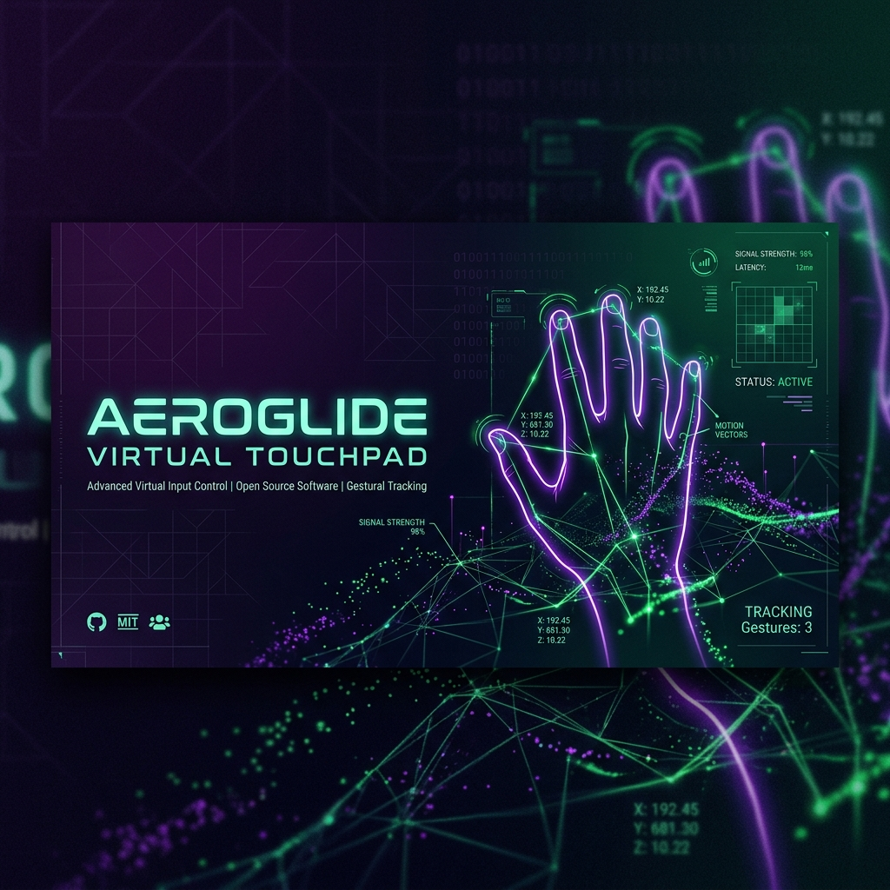
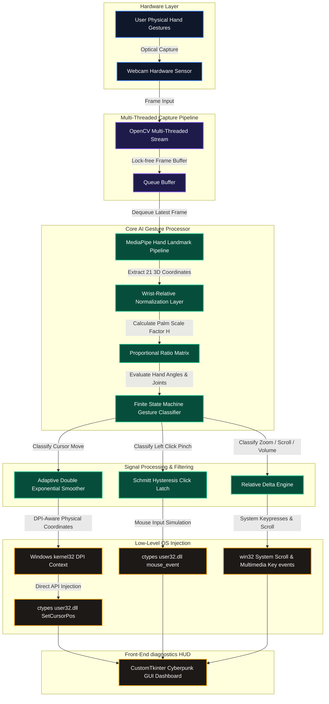

<!-- DYNAMIC GRADIENT ANIMATED WAVING HEADER -->
<p align="center">
  
</p>

<!-- DYNAMIC TYPING SVG HEADER -->
<p align="center">
  <a href="https://github.com/idusha-manaka/AeroGlide">
    
  </a>
</p>

<!-- HIGH-CONTRAST METRICS & OS SHIELDS -->
<p align="center">
  <a href="https://github.com/idusha-manaka/AeroGlide">
    
  </a>
  
  
  
  
</p>

<!-- NEON PANORAMIC REPOSITORY BANNER -->
<p align="center">
  
</p>

<!-- HIGH-TECH GLOWING DIVIDER -->
<p align="center">
  
</p>

<br>

---

## 💎 The AeroGlide Advantage

Traditional virtual touchpads suffer from severe cursor drift, click latency, and coordinate scaling issues. AeroGlide uses low-level Windows kernel simulation and dynamic hand-scaling to deliver a flawless, high-fidelity experience:

<br>

<table width="100%" style="border-collapse: collapse; border: none; background: transparent;">
  <thead>
    <tr style="background: #141416; border-bottom: 2px solid #2c2c35;">
      <th align="left" width="40%" style="padding: 14px; font-size: 15px; color: #a0a0ab; border: none;">Feature Checklist</th>
      <th align="center" width="30%" style="padding: 14px; font-size: 15px; color: #FF4040; border: none;">Standard Mouse Apps</th>
      <th align="center" width="30%" style="padding: 14px; font-size: 15px; color: #00FF80; border: none;">AeroGlide Touchpad</th>
    </tr>
  </thead>
  <tbody>
    <tr style="border-bottom: 1px solid #1E1E24; background: transparent;">
      <td style="padding: 14px; font-size: 14px; font-weight: 600; color: #e0e0e5; border: none;">⚡ **Input Execution Latency**</td>
      <td align="center" style="padding: 14px; font-size: 14px; color: #ff5555; border: none;">🔴 High Lag (30ms - 50ms)</td>
      <td align="center" style="padding: 14px; font-size: 14px; color: #00FF80; font-weight: 600; border: none;">🟢 Instant (Zero-Lag win32)</td>
    </tr>
    <tr style="border-bottom: 1px solid #1E1E24; background: transparent;">
      <td style="padding: 14px; font-size: 14px; font-weight: 600; color: #e0e0e5; border: none;">🖥️ **DPI Scaling (125%/150%)**</td>
      <td align="center" style="padding: 14px; font-size: 14px; color: #ff5555; border: none;">❌ Stuck (fails on laptop screens)</td>
      <td align="center" style="padding: 14px; font-size: 14px; color: #00FF80; font-weight: 600; border: none;">✅ 1:1 Pixel-Perfect DPI Aware</td>
    </tr>
    <tr style="border-bottom: 1px solid #1E1E24; background: transparent;">
      <td style="padding: 14px; font-size: 14px; font-weight: 600; color: #e0e0e5; border: none;">📈 **Cursor Precision Damping**</td>
      <td align="center" style="padding: 14px; font-size: 14px; color: #ff5555; border: none;">❌ Unstable (high tremor jitter)</td>
      <td align="center" style="padding: 14px; font-size: 14px; color: #00FF80; font-weight: 600; border: none;">✅ Adaptive Smoothing Filter</td>
    </tr>
    <tr style="border-bottom: 1px solid #1E1E24; background: transparent;">
      <td style="padding: 14px; font-size: 14px; font-weight: 600; color: #e0e0e5; border: none;">📐 **Hand Tilt & Orientation**</td>
      <td align="center" style="padding: 14px; font-size: 14px; color: #ff5555; border: none;">❌ Fails (strict y-axis targets)</td>
      <td align="center" style="padding: 14px; font-size: 14px; color: #00FF80; font-weight: 600; border: none;">✅ Rotation-Independent Ratios</td>
    </tr>
    <tr style="border-bottom: none; background: transparent;">
      <td style="padding: 14px; font-size: 14px; font-weight: 600; color: #e0e0e5; border: none;">🛡️ **Accidental Auto-Clicks**</td>
      <td align="center" style="padding: 14px; font-size: 14px; color: #ff5555; border: none;">❌ Irritating micro-clicks</td>
      <td align="center" style="padding: 14px; font-size: 14px; color: #00FF80; font-weight: 600; border: none;">✅ Schmitt Latch Latching</td>
    </tr>
  </tbody>
</table>

<br>

---

## 🔮 Futuristic Features Showcase

<br>

<!-- FEATURE BLOCK 1: WIN32 ACCELERATION -->
<table width="100%" style="border-collapse: collapse; border: none; background: transparent; margin-bottom: 25px;">
  <tr style="border: none; background: transparent;">
    <td width="55%" style="padding: 20px 10px; border: none; vertical-align: middle;">
      <span style="background: rgba(0, 255, 128, 0.1); color: #00FF80; font-size: 11px; font-weight: bold; padding: 4px 12px; border-radius: 20px; border: 1px solid rgba(0, 255, 128, 0.3); font-family: 'Outfit';">OS LEVEL PERFORMANCE</span>
      <h2 style="margin-top: 10px; color: #ffffff; font-size: 26px; font-weight: 800; font-family: 'Outfit'; border-bottom: none;">⚡ win32 Kernel Acceleration & DPI Awareness</h2>
      <p style="font-size: 14px; color: #b0b0b5; line-height: 1.6; margin-top: 12px; font-family: 'Inter';">
        AeroGlide completely bypasses standard high-level cursor automation libraries by calling the kernel-level Windows <b>User32 API</b> (<code>SetCursorPos</code> and <code>mouse_event</code>) directly via Python ctypes. Clicks, drags, and scrolling are injected directly into the OS. By calling <code>SetProcessDPIAware()</code>, tracking matches 1:1 with physical screen pixels on Windows laptops, overcoming 125%/150% display scaling issues.
      </p>
    </td>
    <td width="45%" style="padding: 10px; border: none; text-align: right;">
      
    </td>
  </tr>
</table>

<br>

<!-- FEATURE BLOCK 2: GEOMETRIC PROPORTIONS -->
<table width="100%" style="border-collapse: collapse; border: none; background: transparent; margin-bottom: 25px;">
  <tr style="border: none; background: transparent;">
    <td width="45%" style="padding: 10px; border: none;">
      
    </td>
    <td width="55%" style="padding: 20px 20px; border: none; vertical-align: middle;">
      <span style="background: rgba(0, 223, 255, 0.1); color: #00DFFF; font-size: 11px; font-weight: bold; padding: 4px 12px; border-radius: 20px; border: 1px solid rgba(0, 223, 255, 0.3); font-family: 'Outfit';">GEOMETRIC ALGORITHMS</span>
      <h2 style="margin-top: 10px; color: #ffffff; font-size: 26px; font-weight: 800; font-family: 'Outfit'; border-bottom: none;">📐 Proportional & Rotation Independent Tracking</h2>
      <p style="font-size: 14px; color: #b0b0b5; line-height: 1.6; margin-top: 12px; font-family: 'Inter';">
        Traditional gesture systems fail when the hand is tilted or when the back of the hand faces the camera. AeroGlide uses <b>Proportional Euclidean Distances to the Wrist</b> normalized by the dynamic palm size $H = \text{distance}(\text{Wrist}, \text{Middle MCP})$. This scale and rotation-independent algorithm guarantees flawless tracking regardless of whether your hand is kept straight, sideways, palm-facing, or back-facing!
      </p>
    </td>
  </tr>
</table>

<br>

<!-- FEATURE BLOCK 3: SMOOTHING & HYSTERESIS -->
<table width="100%" style="border-collapse: collapse; border: none; background: transparent; margin-bottom: 20px;">
  <tr style="border: none; background: transparent;">
    <td width="55%" style="padding: 20px 10px; border: none; vertical-align: middle;">
      <span style="background: rgba(255, 64, 64, 0.1); color: #FF4040; font-size: 11px; font-weight: bold; padding: 4px 12px; border-radius: 20px; border: 1px solid rgba(255, 64, 64, 0.3); font-family: 'Outfit';">COGNITIVE LATENCY LATCH</span>
      <h2 style="margin-top: 10px; color: #ffffff; font-size: 26px; font-weight: 800; font-family: 'Outfit'; border-bottom: none;">🛡️ Schmitt Trigger Click Latch & Adaptive Filtering</h2>
      <p style="font-size: 14px; color: #b0b0b5; line-height: 1.6; margin-top: 12px; font-family: 'Inter';">
        AeroGlide integrates an intelligent <b>Adaptive Exponential Smoother</b> that automatically increases damping at slow speeds to eliminate micro-tremors (pixel-perfect precision) and decreases damping at high speeds to achieve zero dragging latency. Accidental hover clicks are blocked by a <b>Schmitt Trigger (Hysteresis latch)</b>: clicks activate below <code>0.032</code> units and only release when fingers open beyond <code>0.047</code>, giving a smooth "magnetic" latch feel!
      </p>
    </td>
    <td width="45%" style="padding: 10px; border: none; text-align: right;">
      
    </td>
  </tr>
</table>

<br>

---

## 💻 Recommended Specs for Windows 10 / 11

To achieve hardware-accelerated 30+ FPS butter-smooth navigation, your Windows device should meet or exceed these specifications:

<br>

<table width="100%" style="border-collapse: collapse; border: none; background: transparent;">
  <thead>
    <tr style="background: #141416; border-bottom: 2px solid #2c2c35;">
      <th align="left" width="30%" style="padding: 12px; border: none; color: #a0a0ab; font-size:15px;">System Resource</th>
      <th align="left" width="35%" style="padding: 12px; border: none; color: #ff9d00; font-size:15px;">Minimum Requirement</th>
      <th align="left" width="35%" style="padding: 12px; border: none; color: #00FF80; font-size:15px;">Recommended Target (Optimal)</th>
    </tr>
  </thead>
  <tbody>
    <tr style="border-bottom: 1px solid #1E1E24; background: transparent;">
      <td style="padding: 12px; font-weight: bold; border: none; color: #e0e0e5;">Operating System</td>
      <td style="padding: 12px; border: none; color: #b0b0b5;">Windows 10 (64-bit, Build 19044+)</td>
      <td style="padding: 12px; border: none; color: #00FF80; font-weight:600;">Windows 11 (64-bit, Build 22000+)</td>
    </tr>
    <tr style="border-bottom: 1px solid #1E1E24; background: transparent;">
      <td style="padding: 12px; font-weight: bold; border: none; color: #e0e0e5;">Python Runtime</td>
      <td style="padding: 12px; border: none; color: #b0b0b5;">Python 3.11.x (Stable x64)</td>
      <td style="padding: 12px; border: none; color: #00FF80; font-weight:600;">Python 3.12.x (Highly Optimized MediaPipe wheels)</td>
    </tr>
    <tr style="border-bottom: 1px solid #1E1E24; background: transparent;">
      <td style="padding: 12px; font-weight: bold; border: none; color: #e0e0e5;">Webcam Sensor</td>
      <td style="padding: 12px; border: none; color: #b0b0b5;">Integrated HD Web Camera (720p @ 30 FPS)</td>
      <td style="padding: 12px; border: none; color: #00FF80; font-weight:600;">USB Web Camera (1080p @ 60 FPS / Low-exposure)</td>
    </tr>
    <tr style="border-bottom: 1px solid #1E1E24; background: transparent;">
      <td style="padding: 12px; font-weight: bold; border: none; color: #e0e0e5;">CPU Processor</td>
      <td style="padding: 12px; border: none; color: #b0b0b5;">Intel Core i3 / AMD Ryzen 3 (Dual-Core @ 2.0 GHz)</td>
      <td style="padding: 12px; border: none; color: #00FF80; font-weight:600;">Intel Core i5 / AMD Ryzen 5 (Quad-Core @ 3.0 GHz+)</td>
    </tr>
    <tr style="border-bottom: 1px solid #1E1E24; background: transparent;">
      <td style="padding: 12px; font-weight: bold; border: none; color: #e0e0e5;">System Memory (RAM)</td>
      <td style="padding: 12px; border: none; color: #b0b0b5;">4 GB RAM</td>
      <td style="padding: 12px; border: none; color: #00FF80; font-weight:600;">8 GB RAM or Higher</td>
    </tr>
    <tr style="border-bottom: 1px solid #1E1E24; background: transparent;">
      <td style="padding: 12px; font-weight: bold; border: none; color: #e0e0e5;">GPU Co-Processor</td>
      <td style="padding: 12px; border: none; color: #b0b0b5;">Direct3D 11 Compatible Integrated Graphics</td>
      <td style="padding: 12px; border: none; color: #00FF80; font-weight:600;">NVIDIA GeForce / AMD Radeon Dedicated GPU (CUDA acceleration)</td>
    </tr>
    <tr style="border-bottom: none; background: transparent;">
      <td style="padding: 12px; font-weight: bold; border: none; color: #e0e0e5;">Display Support</td>
      <td style="padding: 12px; border: none; color: #b0b0b5;">Standard 1080p Desktop Display (100% DPI Scaling)</td>
      <td style="padding: 12px; border: none; color: #00FF80; font-weight:600;">High-DPI Laptop Display (125% - 150% scaling, fully aware)</td>
    </tr>
  </tbody>
</table>

> [!NOTE]
> **Python 3.13 Warning:** MediaPipe does not provide pre-compiled wheels for Python 3.13+ on Windows yet. Attempting to build inside a Python 3.13 environment will trigger compilation errors. Please stick strictly to **Python 3.12.x** or **3.11.x**.

<br>

---

## 🎮 Highly Detailed Gesture Blueprint

AeroGlide parses hand landmarks proportionally based on Euclidean matrices. The following responsive SVG diagram details each supported hand gesture. 

> [!TIP]
> **Theme Adaptive View:** The vector diagram below is dynamically stylized with embedded media queries. It will automatically adjust its backgrounds, stroke outlines, and text colors to look absolutely gorgeous whether you use **GitHub Dark Mode** or **GitHub Light Mode**!

<p align="center">
  
</p>

### 1. ☝️ Cursor Navigation
* **Anatomical Configuration:** The Index finger is open. Middle, Ring, and Pinky fingers must be folded.
* **Proportional Metric:** Index distance to wrist ratio $D_{\text{index}} > 1.30 \times H$. Middle distance ratio $D_{\text{middle}} \le 1.30 \times H$.
* **Smoothing & Acceleration:** Utilizes an adaptive exponential filter. Cursor speed scales logarithmically to prevent pixel jumpiness during micro-movements, allowing perfect target acquisition.

### 2. 🤌 Left Click & Drag and Drop
* **Anatomical Configuration:** Index and Thumb tips pinched together while other fingers are folded.
* **Proportional Metric:** Euclidean distance between Index and Thumb tips drops below click threshold (e.g. $D < 0.032 \times H$).
* **Hysteresis Latch:** Controlled by a Schmitt Trigger. The click state remains latched (`is_clicked = True`) as long as $D < 0.047 \times H$. If held for more than `0.4` seconds, it enters **Drag Mode** (holds mouse down). Releasing the pinch drops the item.

### 3. ✌️ Right Click & Page Scroll
* **Right Click:** Pinch Middle finger and Thumb together while Index is kept open and Ring/Pinky are folded.
  * *Accidental Pinch Prevention:* Verified by checking that the middle finger is not curled inside the palm boundary.
* **Page Scroll:** Hold Index and Middle fingers open close together (distance between tips $< 0.06 \times H$) and slide your hand up/down/left/right. This scrolls pages vertically or horizontally in a highly fluid manner.

### 4. 🖐️ Zoom In / Out
* **Anatomical Configuration:** All 5 fingers open (open hand position).
* **Proportional Metric:** Measures the span between Thumb and Index tips. 
* **Behavior:** Spread Thumb and Index wide apart to **Zoom In** (simulates Ctrl + Scroll Up). Pinch Thumb and Index close together to **Zoom Out** (simulates Ctrl + Scroll Down). Completely blocks accidental zoom clicks during standard mouse navigation!

### 5. 👌 System Volume Dial
* **Anatomical Configuration:** Thumb, Index, and Middle fingers are open. Ring and Pinky are folded.
* **Behavior:** Raise your hand upward to **Volume UP**; lower your hand downward to **Volume DOWN**. Perfect for media players!

<br>

---

## 🛠️ System Architecture Blueprint

The diagram below details the data flow from physical webcam sensor capture to low-level win32 ctypes mouse simulation:



<br>

---

## 📥 Detailed Installation & Virtual Environments

AeroGlide works best in a dedicated Python virtual environment to prevent package version conflicts on Windows. Follow one of the detailed guides below.

### Path A: Clean Virtual Environment (Recommended)

1. **Prerequisite Check:**
   Make sure Python 3.12 (64-bit) and Git are installed on your computer. You can check your Python version by running:
   ```cmd
   python --version
   ```

2. **Clone the repository:**
   Open a terminal (Command Prompt or PowerShell) and run:
   ```bash
   git clone https://github.com/idusha-manaka/AeroGlide.git
   cd AeroGlide
   ```

3. **Initialize the Virtual Environment:**
   Create a local isolated `.venv` environment inside the root folder:
   ```bash
   python -m venv .venv
   ```

4. **Activate the Virtual Environment:**
   * **In Windows Command Prompt (cmd):**
     ```cmd
     .venv\Scripts\activate.bat
     ```
   * **In Windows PowerShell:**
     If you encounter script blockages, bypass execution policies for this process:
     ```powershell
     Set-ExecutionPolicy -Scope Process -ExecutionPolicy Bypass
     .venv\Scripts\Activate.ps1
     ```

5. **Upgrade PIP & Install Dependencies:**
   Install pip tools and the exact dependencies needed:
   ```bash
   python -m pip install --upgrade pip
   python -m pip install mediapipe==0.10.14 pyautogui customtkinter opencv-python
   ```

6. **Launch AeroGlide:**
   ```bash
   python app.py
   ```

---

### Path B: Anaconda / Miniconda Installation

If you prefer managing environments through Conda, use the following commands:

1. **Create and initialize a Python 3.12 environment:**
   ```bash
   conda create -n aeroglider python=3.12 -y
   ```

2. **Activate your newly created environment:**
   ```bash
   conda activate aeroglider
   ```

3. **Install the dependencies:**
   ```bash
   pip install mediapipe==0.10.14 pyautogui customtkinter opencv-python
   ```

4. **Run the dashboard application:**
   ```bash
   python app.py
   ```

---

### Path C: Quick Launch Terminal Console

For quick copy-pasting, here is our interactive mock terminal sequence:

```
┌────────────────────────────────────────────────────────────────────────┐
│  idusha-manaka @ AeroGlide ~                                           │
├────────────────────────────────────────────────────────────────────────┤
│  $ git clone https://github.com/idusha-manaka/AeroGlide.git           │
│  $ cd AeroGlide                                                       │
│  $ pip install mediapipe==0.10.14 pyautogui customtkinter opencv-python │
│  $ python app.py                                                       │
└────────────────────────────────────────────────────────────────────────┘
```

<br>

---

## ⚙️ Calibration & Customization Settings

AeroGlide features an advanced CustomTkinter Cyberpunk Dark Mode GUI dashboard. The UI is designed to give you precise control over tracking filters.

### 🎛️ Control Panel Parameters Guide

* **Cursor Speed / Sensitivity:** 
  * *Purpose:* Adjusts the dynamic scale factor of the Active Zone boundary in front of the camera.
  * *Behavior:* Set to `0.70x` or `0.80x` for relaxed, low-fatigue navigation. Higher values (e.g. `1.2x`) shrink the active zone, translating small hand movements into rapid cursor sweeps across 4K displays.
* **Fine Precision Smoothing:** 
  * *Purpose:* Controls the Double Exponential Smoother's $\alpha$ damping coefficient during slow, precise cursor movements.
  * *Behavior:* Sliding this lower (e.g. `0.02` - `0.05`) increases historical coordinates weighting. This eliminates hand tremors and jitter entirely, perfect for precise button clicks, vector drawing, or UI design work.
* **Fast Motion Responsiveness:** 
  * *Purpose:* Sets the acceleration coefficient when moving your hand rapidly.
  * *Behavior:* Keep this high (e.g. `0.80` - `0.90`) to achieve zero-lag, instant pointer catching when moving across multiple screens.
* **Pinch Click Threshold:** 
  * *Purpose:* Adjusts the Euclidean distance between thumb and index landmarks at which a click triggers.
  * *Behavior:* Default is `0.032`. If clicks trigger too easily (accidental clicks), slide this lower (e.g. `0.025`). If pinching requires too much force, slide this higher (e.g. `0.038`).

### ⚙️ Programmatic Settings Tuning
For advanced configuration without opening the HUD dashboard, you can tweak default constants inside `gesture_engine.py`:
```python
# Low-level Engine Constants (gesture_engine.py)
CLICK_THRESHOLD = 0.032    # The initial pinch trigger distance
RELEASE_THRESHOLD = 0.047  # The release pinch distance (latch margin)
SCROLL_THRESHOLD = 0.060   # Scroll trigger distance for dual fingers
SMOOTH_FACTOR = 0.15       # Baseline filter coefficient
```

---

## ⚠️ Known Limitations

While AeroGlide is highly optimized for performance, users should be aware of the following technical limitations:

* **💡 Extreme Backlighting & Low Lighting:** Because camera sensors capture frames at 30 FPS, dark rooms degrade the optical flow. Strong light sources behind the user (e.g. sitting in front of a bright window) will silhouette the hand, causing landmark detection failures. Use front or side lighting for optimal results.
* **👥 Background Hand Interference:** MediaPipe's tracking pipeline searches for the primary hand. If another person is sitting in the camera's field of view or if your other hand crosses the workspace, it may jump tracking. Keep a clear workspace.
* **🖥️ Multi-Display Mapping:** By default, low-level ctypes user32 calls map the normalized coordinate space to the **Primary Monitor** bounds. If you run a dual-monitor setup, ensure the window you want to navigate is placed on your main display.
* **🔋 Power Saving & CPU Throttling:** On Windows laptops running on "Best Power Efficiency" battery profiles, CPU throttling may drop OpenCV acquisition speeds. For butter-smooth cursor motion, plug your laptop in or select the "High Performance" power profile.

---

## 📈 Stargazers Trends over Time

Show your support for this futuristic gesture navigation touchpad! Star the repository to track our growing community graph below:

<p align="center">
  <a href="https://github.com/idusha-manaka/AeroGlide">
    
  </a>
</p>

<br>

---

## 💬 Exhaustive Troubleshooting FAQ

### ❌ `AttributeError: module 'mediapipe' has no attribute 'solutions'`
* **Why:** In newer experimental versions of MediaPipe (e.g. 0.10.35+), Google has completely deprecated and removed the legacy Solutions API (`solutions.hands`).
* **Fix:** You must downgrade your MediaPipe version to `0.10.14` by running the following command in your active environment:
  ```bash
  python -m pip uninstall mediapipe -y
  python -m pip install mediapipe==0.10.14
  ```

### 🎥 The webcam window is blank or the program crashes on startup
* **Why:** The default camera index is set to `0` (typically the built-in laptop camera). If you have external webcams, virtual cameras (e.g., OBS, droidcam), or face-recognition cameras, index `0` might be occupied.
* **Fix:** Open `video_stream.py`, locate the `__init__` constructor, and change `src=0` to `src=1` or `src=2`. Ensure no other apps (Zoom, Teams, Discord) are actively locking the webcam.

### 🛡️ Windows UAC blocks mouse clicks in task manager/admin cmd
* **Why:** Windows User Account Control (UAC) security architecture explicitly prevents standard-privileged processes (like your terminal python script) from injecting simulated input into high-privilege windows.
* **Fix:** Close all administrative windows, or run your Command Prompt / PowerShell terminal **as Administrator** to grant inputs simulation permission globally!

### 📉 Framerate feels low (Webcam feed stuttering or lagging)
* **Why:** MediaPipe hand tracking is CPU-intensive. If your camera captures in full HD (1080p), resizing overhead slows down the main processing loop.
* **Fix:** AeroGlide runs a background acquisition thread to offset this. However, make sure your camera capture resolution is capped at `640x480` inside `video_stream.py` to ensure optimal 30+ FPS processing speeds.

### 🖱️ My cursor gets stuck near the screen edges
* **Why:** This happens on High-DPI screens (e.g. 4K laptops with 150% scaling) when Python doesn't recognize physical screen dimensions correctly.
* **Fix:** AeroGlide automatically calls `SetProcessDPIAware()` on startup, but you can also manually verify that your primary screen resolution is set correctly in Windows settings. Ensure you calibrate the "Sensitivity" slider in the GUI to `0.70x` or `0.80x` to reduce the physical hand movement required.

### ❓ MediaPipe DLL load fails on startup
* **Why:** Windows is missing crucial C++ runtime libraries required by MediaPipe's C++ binaries.
* **Fix:** Download and install the latest [Microsoft Visual C++ Redistributable (X64)](https://aka.ms/vs/17/release/vc_redist.x64.exe) package.

---

## 📄 License
This project is licensed under the MIT License - see the [LICENSE](LICENSE) file for details.

## 🤝 Community & Support
<p align="center">
  <a href="https://github.com/idusha-manaka">
    
  </a>
</p>

Developed with ❤️ by [Idusha Manaka](https://github.com/idusha-manaka). Feel free to raise issues, submit pull requests, or star the repository to show your support!

