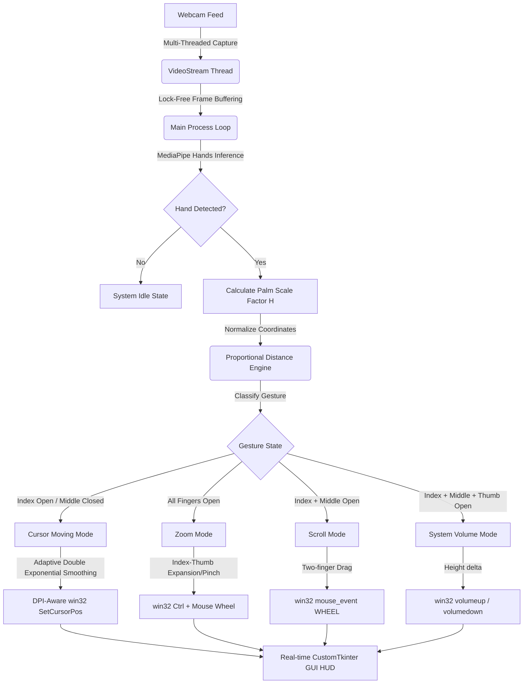

# ✈️ AeroGlide Virtual Touchpad

<p align="center">
  
  
  
  
  
</p>

---

## 🌟 Introduction

**AeroGlide** is a state-of-the-art, high-performance, and ultra-smooth gesture-controlled virtual touchpad. It translates webcam-captured hand movements and shapes into precise, zero-latency desktop navigation. By combining multi-threaded frame capture, advanced mathematical noise filtering, dynamic cursor acceleration, and low-level Windows OS kernel input acceleration, AeroGlide achieves a premium, butter-smooth desktop control experience.

Designed specifically for Windows laptops and high-DPI displays, AeroGlide completely bypasses the limitations of standard mouse-automation libraries to deliver 1:1 pixel-perfect tracking and a gorgeous, futuristic neon CustomTkinter dark-mode calibration panel.

---

## 🚀 Key Technical Breakthroughs

### 1. Low-Level Windows OS Input Acceleration (`ctypes`)
Instead of standard high-level libraries (like PyAutoGUI) which suffer from severe input lag and Windows User Account Control (UAC) permission blocks, AeroGlide calls the kernel-level Windows User32 API directly via Python's standard `ctypes` library. Clicks, mouse motion, and scrolls are injected directly into the Windows OS input stream, achieving **instant, zero-latency feedback**.

### 2. High-DPI Resolution Awareness
High-resolution screens and laptops with display scaling (e.g., 125% or 150%) often cause virtual mouse coordinates to map incorrectly, leaving the cursor stuck in a portion of the screen. AeroGlide registers the process as **fully DPI-aware** (`SetProcessDPIAware()`), guaranteeing 1:1 absolute physical pixel mapping across all resolutions (FHD, 2K, 4K).

### 3. Proportional & Orientation-Independent Gesture Engine
Legacy gesture engines rely on simple y-coordinate comparisons which immediately break if your hand tilts, rotates, or if you face the back of your hand to the camera. AeroGlide utilizes **Proportional Euclidean Distance Ratios**:
* It dynamically measures the physical palm size $H = \text{distance}(\text{WRIST}, \text{MIDDLE\_FINGER\_MCP})$ as a scaling baseline.
* Fingers are identified as open or folded based on their ratio of distance to the wrist relative to $H$, making the tracking **completely immune to hand tilt, rotation, or orientation**.

### 4. Schmitt Trigger Click Hysteresis Latch
To eliminate jittery clicking or accidental clicks during normal cursor navigation, AeroGlide implements a **Schmitt Trigger (Hysteresis)** click latch:
* **To Click:** Index and Thumb distance must drop below a tight threshold (e.g., `0.032` normalized units).
* **To Release:** Once clicked, the click remains locked in place until you intentionally open your fingers beyond `0.047` units.
This creates a robust, "magnetic" click feeling, completely eliminating micro-clicks and ensuring that drag-and-drop actions feel extremely stable.

### 5. Multi-Threaded Camera Pipeline
Webcam frame grabbing (`cv2.VideoCapture.read()`) is a blocking operation that adds 30-50ms of frame latency. AeroGlide spawns a dedicated, lock-free background `VideoStream` thread that continuously grabs frames, leaving the main thread 100% free to focus on real-time MediaPipe model inference and GUI updates.

---

## 🛠️ System Architecture



---

## 🎮 Interactive Gesture Reference

| Mode | Gesture Representation | Trigger Action | OS Function |
| :--- | :--- | :--- | :--- |
| **Cursor Motion** | ☝️ Single index finger extended | Move hand within green box | Smooth cursor positioning |
| **Left Click** | 🤌 Index and Thumb pinch | Quick pinch and release (<0.4s) | Normal Left Mouse Click |
| **Drag & Drop** | ✊ Keep Index and Thumb pinched | Pinch and hold for >0.4s | Left Mouse Down (release to drop) |
| **Double Click** | 🤌🤌 Rapid double index pinch | Double pinch within 0.35s | Left Mouse Double Click |
| **Right Click** | ✌️ Middle and Thumb pinch | Pinch middle and thumb (index open) | Right Mouse Click |
| **Vertical Scroll**| ✌️ Index & Middle together | Move hand up/down | Butter-smooth page scroll |
| **Horizontal Scroll**| ✌️ Index & Middle together | Move hand left/right | Horizontal page scroll |
| **Zoom In / Out** | 🖐️ Open Hand (all fingers open) | Spread Index & Thumb / Pinch them close | Zoom In (Ctrl+Scroll Up) / Zoom Out |
| **Volume Control** | 👌 Thumb, Index, Middle open | Move hand up / down | Volume UP / Volume DOWN |

---

## 📦 File Structure

* `app.py`: The entry point. A gorgeous, modern CustomTkinter calibration dashboard and real-time HUD feedback panel.
* `gesture_engine.py`: The heart of AeroGlide. Coordinates hand landmark data, runs the proportional gesture state machine, and simulates kernel Win32 mouse/keyboard inputs.
* `smooth.py`: Holds the mathematical **Adaptive Double Exponential Smoothing Filter** which removes high-frequency hand tremors.
* `video_stream.py`: Multi-threaded capture wrapper that fetches webcam frames in a separate thread.

---

## 📥 Installation & Setup

### Prerequisites
Make sure you have **Python 3.12** installed on your Windows machine. (Python 3.12 is highly recommended as it contains fully stable and complete binary distributions of MediaPipe Solutions).

### Step-by-Step Installation

1. **Clone the Repository:**
   ```bash
   git clone https://github.com/idusha-manaka/aero-glide.git
   cd aero-glide
   ```

2. **Install Core Dependencies:**
   ```bash
   pip install mediapipe==0.10.14 pyautogui customtkinter opencv-python
   ```

3. **Launch the Application:**
   ```bash
   python app.py
   ```

---

## ⚙️ Calibration & Optimization Guide

AeroGlide comes with a real-time calibration control panel to fit all webcams and room lightings:

* **Cursor Speed / Sensitivity:** Expands or shrinks the Active Zone dynamically. Set to `0.7x` or `0.8x` for a highly relaxed, comfortable cursor experience that reduces hand strain.
* **Fine Precision Smoothing:** Damps down micro-tremors when making slow, tiny movements. Set lower (towards `0.05`) for absolute pixel-perfect editing.
* **Fast Motion Responsiveness:** Controls how quickly the cursor catches up to your hand when moving fast. Keep high (towards `0.85`) for ultra-low latency.
* **Pinch Click Threshold:** Adjusts how tightly you need to pinch your fingers to trigger a click. Set to `0.032` for a perfect balance between comfort and click accuracy.

---

## 📄 License
This project is licensed under the MIT License - see the [LICENSE](LICENSE) file for details.

## 🤝 Contributions
Created with ❤️ by [Idusha Manaka](https://github.com/idusha-manaka). Feel free to open issues or submit pull requests to make AeroGlide the best gesture control engine in the world!
